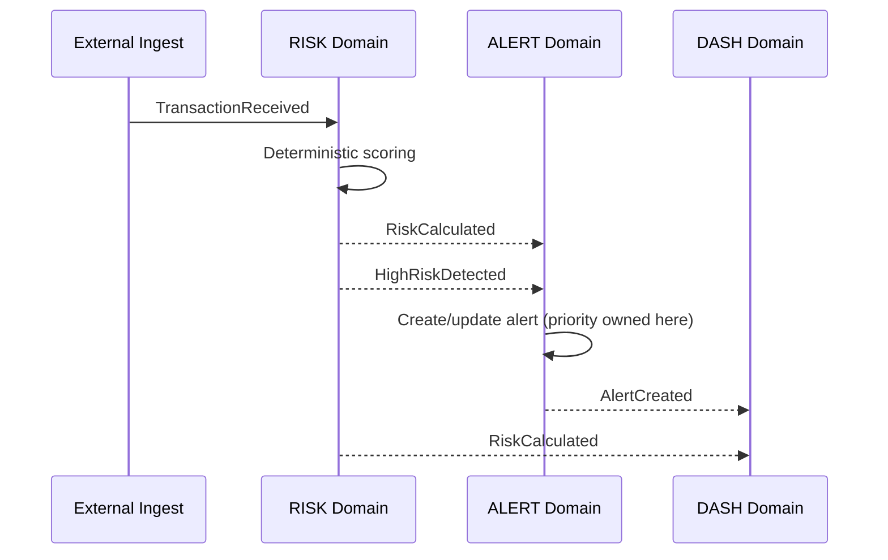
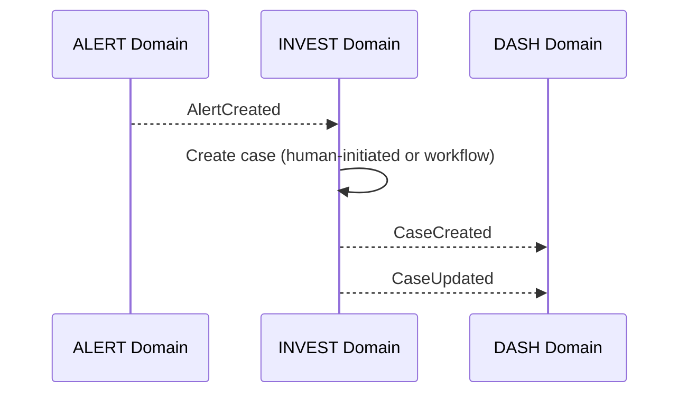

# Event Architecture

## Document Information

| Field | Value |
|--------|-------|
| Project | Sentinel AI |
| Document | Event Architecture |
| Version | 1.0 (Draft) |
| Status | Draft — Phase 2 |
| Owner | Architecture Team |
| Last Updated | 2026-09-03 |
| Authority | Event contract governance; frozen events in FDS/FRS are not renamed |

---

## Purpose

Define event-driven architecture foundations for Sentinel AI: naming, envelope, delivery semantics, idempotency, schema evolution, and event categories.

**Governance:** Existing frozen publish/consume contracts in FDS and domain FRs are authoritative. This document describes **how** events are structured and processed—not **which** events to rename or add to frozen domains.

Legacy skeleton: [EventDrivenArchitecture.md](EventDrivenArchitecture.md) — superseded by this document for Phase 2.

---

## Event Categories

| Category | Purpose | Examples |
|----------|---------|----------|
| **Domain event** | Significant state change in owning domain | `AlertCreated`, `CaseClosed`, `RiskCalculated` |
| **Integration event** | Cross-domain notification of domain events | Same payloads; routed via event infrastructure |
| **Command** | Request for action (synchronous or async) | Create case request via API (preferred for commands) |
| **Query** | Read-only request | REST/GraphQL reads — not event-sourced |
| **Audit event** | Immutable record of sensitive action | Emitted via CORE audit pipeline |
| **Notification** | User/operator notification delivery | Deferred/Version 2 in most domains |

---

## Event Naming Conventions

| Rule | Example |
|------|---------|
| PascalCase past-tense for domain events | `RiskCalculated`, `CaseUpdated` |
| Domain prefix in FR IDs only—not in event name | `RISK` owns `RiskCalculated` |
| No vendor prefixes | Not `KafkaRiskCalculated` |
| Stable names across releases | Add fields; do not rename frozen events |

---

## Event Envelope (Logical)

Every domain event SHALL include a logical envelope:

```json
{
  "eventId": "uuid-v4",
  "eventType": "RiskCalculated",
  "schemaVersion": "1.0",
  "timestamp": "2026-09-03T12:00:00Z",
  "producer": "risk-service",
  "correlationId": "uuid-v4",
  "causationId": "uuid-v4-or-null",
  "organizationId": "org-uuid",
  "payload": { },
  "metadata": {
    "classification": "internal",
    "idempotencyKey": "stable-business-key"
  }
}
```

| Field | Requirement |
|-------|-------------|
| `eventId` | Globally unique per emission |
| `eventType` | Matches FDS frozen event name |
| `schemaVersion` | Semantic version for payload schema |
| `timestamp` | ISO-8601 UTC producer time |
| `producer` | Owning domain service identifier |
| `correlationId` | End-to-end workflow correlation |
| `causationId` | Parent event or request ID |
| `organizationId` | Tenant scope where applicable |
| `metadata.classification` | Data classification for routing/protection |
| `metadata.idempotencyKey` | Stable key for consumer deduplication |

---

## Identity and Correlation

| ID type | Scope | Usage |
|---------|-------|-------|
| **Event ID** | Single emission | Deduplication, audit reference |
| **Correlation ID** | End-to-end workflow | Traces, logs, support investigation |
| **Causation ID** | Parent-child events | Causal chains (RISK → ALERT → INVEST) |
| **Idempotency key** | Business operation | Consumer idempotent processing |

Correlation IDs originate at user request or external ingest boundary and propagate through events and synchronous calls.

---

## Delivery Semantics

| Aspect | Policy |
|--------|--------|
| **Default guarantee** | At-least-once delivery |
| **Ordering** | Per-partition ordering by aggregate key (e.g., `userId`, `caseId`) where required |
| **Consumer responsibility** | Idempotent processing; tolerate duplicates and out-of-order within documented windows |
| **Producer responsibility** | Publish after durable commit of authoritative state |
| **Retry** | Exponential backoff with max attempts |
| **Dead letter** | Failed messages after retry exhaustion → DLQ with operator alert |
| **Malformed events** | Reject/quarantine; never corrupt consumer state |

---

## Idempotency

Consumers SHALL:

1. Track processed `eventId` or `idempotencyKey` within retention window
2. Return success without side effects on duplicate detection
3. Document ordering tolerance per event type

Producers SHALL:

1. Emit stable `idempotencyKey` for retried publishes
2. Not emit contradictory payloads for same idempotency key

---

## Schema Evolution

| Change type | Compatibility |
|-------------|---------------|
| Add optional field | Backward compatible |
| Add required field | Breaking — new schema version + migration |
| Rename field | Breaking — forbidden for frozen events |
| Remove field | Breaking — deprecation period required |

Schema versions use semantic versioning. Consumers ignore unknown optional fields.

---

## Frozen MVP Event Flows (Reference)

### Risk → Alert (MVP)



### Alert → Investigation (MVP)



---

## Producer and Consumer Responsibilities

| Role | Responsibility |
|------|----------------|
| **Producer domain** | Owns event semantics, payload schema, emission after commit |
| **Consumer domain** | Idempotent handling; no lifecycle redefinition of producer |
| **Platform** | Routing, retry, DLQ, observability — implementation phase |

---

## Security Classification in Events

Event metadata SHALL include classification (`public`, `internal`, `confidential`, `restricted`). Routing and logging systems apply redaction based on classification.

PII and investigation evidence identifiers in payloads follow data minimization (NFR-PRIV-001).

---

## Failure Handling

| Scenario | Behavior |
|----------|----------|
| Duplicate delivery | Consumer idempotency |
| Out-of-order (within window) | Consumer reorder or accept eventual consistency |
| Delayed delivery | Consumer processes if still valid; stale events may be ignored per domain rules |
| Broker unavailable | Producer buffers or fails with explicit error; no silent loss |
| Consumer failure | Retry → DLQ → operator intervention |

---

## Vendor Neutrality

Event infrastructure is described as a **message delivery capability**. Specific brokers (Kafka, RabbitMQ, cloud queues) are implementation candidates documented in future ADRs—not product requirements.

---

## Related Documents

- [DomainBoundaries.md](DomainBoundaries.md)
- [FunctionalDomainSpecification.md](../02-requirements/FunctionalDomainSpecification.md)
- [ArchitectureDecisionRecords.md](ArchitectureDecisionRecords.md) — ADR-004
