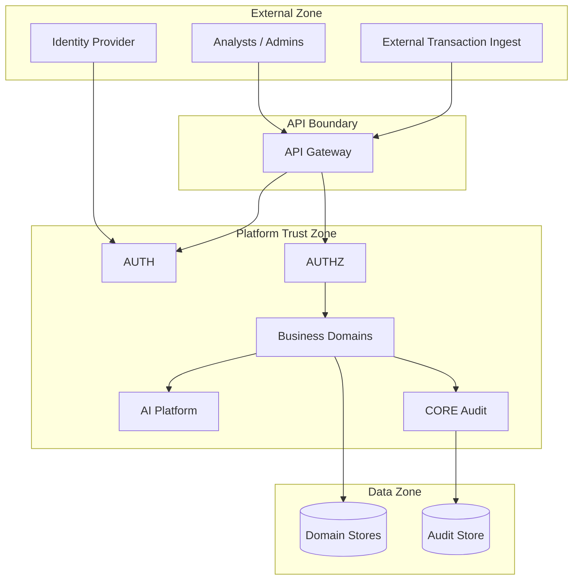

# Security Architecture

## Document Information

| Field | Value |
|--------|-------|
| Project | Sentinel AI |
| Document | Security Architecture |
| Version | 1.0 (Draft) |
| Status | Draft — Phase 2 |
| Owner | Security Architecture |
| Last Updated | 2026-09-03 |

---

## Purpose

Security architecture foundation for Sentinel AI: trust boundaries, identity, access control, data protection, audit, AI security, and threat model foundations.

This is **not** an implementation guide. No vendor products are mandated.

---

## Security Goals

1. Protect exchange operational, investigation, and compliance data
2. Enforce least privilege for humans, services, and AI agents
3. Maintain complete audit trail for sensitive actions
4. Resist common application and AI-specific attacks
5. Fail closed on authorization failures

---

## Trust Boundaries

| Boundary | Controls |
|----------|----------|
| External → API | TLS, authentication, rate limiting, input validation |
| API → Domains | Authorization token, correlation ID, tenant scope |
| Domain → Domain | Service identity, mTLS or signed tokens, contract-scoped access |
| Domain → AI | Tool allowlist, AUTHZ on each tool invocation, data minimization |
| Domain → Data | Encryption at rest, least-privilege DB credentials |

---

## Identity and Authentication

| Actor type | Authentication mechanism |
|------------|-------------------------|
| Human users | AUTH domain — sessions/tokens, MFA for privileged roles |
| Service accounts | Service identity credentials rotated via secret management |
| AI agents | Agent service identity; no super-user privileges |

AUTH owns session lifecycle. See [DomainBoundaries.md](DomainBoundaries.md) — AUTH vs SEC.

---

## Authorization (RBAC)

AUTHZ evaluates permissions on every protected operation.

| Principle | Implementation expectation |
|-----------|---------------------------|
| Least privilege | Role-per-domain scoping (Risk Analyst ≠ Platform Admin) |
| Deny by default | Unmapped permissions → deny |
| Tenant isolation | Organization scope enforced on all data access |
| AI tools | Same AUTHZ model; explicit tool permissions per agent |

Role examples align with [Personas.md](../01-product/Personas.md): Risk Analyst, Compliance Officer, Security Engineer, Platform Administrator.

---

## Service-to-Service Security

| Control | Requirement |
|---------|-------------|
| Identity | Each service has unique service account |
| Transport | Encrypted inter-service communication in non-local environments |
| Token validation | Services validate caller identity and scope |
| No trust inheritance | Compromised service cannot access unrelated domain data |

---

## Data Protection

| State | Control |
|-------|---------|
| In transit | TLS 1.2+ (design objective) |
| At rest | Encryption for confidential/restricted data classifications |
| In AI prompts | Minimize PII; redact where possible; audit prompt access |
| In logs | No secrets, tokens, or full PII in application logs |

---

## API Security

| Control | Description |
|---------|-------------|
| Rate limiting | Auth endpoints and public APIs throttled |
| Input validation | Schema validation on all inputs |
| Output encoding | Prevent injection in responses |
| CORS | Restricted to authorized origins |
| Error handling | No sensitive data in error messages |

---

## Audit and Security Logging

| Log type | Owner | Content |
|----------|-------|---------|
| Audit log | CORE infrastructure; domain outcomes | Sensitive actions, actor, timestamp, outcome |
| Security log | Platform security | Auth failures, privilege escalation attempts |
| Application log | Each domain | Operational diagnostics (no secrets) |

100% audit coverage for sensitive actions per NFR-AUD-001.

---

## Secret Management

Secrets SHALL NOT be stored in source control. Runtime injection via secure mechanism (environment, secret store — vendor TBD in implementation ADR).

Rotation policy required before production.

---

## AI Security

| Threat | Mitigation |
|--------|------------|
| Prompt injection | Input sanitization, system prompt isolation, output validation |
| Tool abuse | Tool allowlist per agent; AUTHZ on every tool call |
| Data leakage | Context minimization; classification-aware retrieval |
| Unsafe recommendations | Human approval for consequential actions; no autonomous enforcement |
| Model supply chain | Approved model registry; version tracking (NFR-AI-004) |

AI agents SHALL NOT receive credentials exceeding their authorized tool scope.

---

## Privileged Operations

| Operation | Requirements |
|-----------|--------------|
| Admin configuration | Privileged role + audit |
| Role assignment | Privileged role + audit |
| Integration configuration | Privileged role + audit |
| Prompt/model promotion | AI governance role + evaluation (V2) |

---

## Threat Model Foundations

| Threat | Affected assets | Primary controls |
|--------|-----------------|------------------|
| Unauthorized data access | Cases, compliance, PII | AUTHZ, tenant isolation, encryption |
| Privilege escalation | Admin functions | RBAC, audit, MFA |
| Event tampering | Event pipeline | Integrity, authZ on publish, audit |
| AI manipulation | Analyst decisions | Prompt injection defenses, human oversight |
| Insider abuse | All domains | Audit, least privilege, access reviews |
| Denial of service | APIs, event pipeline | Rate limiting, scaling, circuit breakers |

Full threat modeling is a Phase 3+ activity. This establishes foundations.

---

## Zero-Trust Orientation

- Never trust network location alone
- Verify identity and authorization on every request
- Assume breach — limit blast radius via domain isolation

---

## Compliance Controls (Architectural)

Sentinel AI supports auditability for regulatory readiness but **does not claim** SOC 2, ISO 27001, or other certifications in Phase 2.

COMP domain workflows support KYC/AML/sanctions evidence collection per frozen FRs.

---

## Related Documents

- [NonFunctionalRequirements.md](../02-requirements/NonFunctionalRequirements.md) — NFR-SEC-*
- [ObservabilityArchitecture.md](ObservabilityArchitecture.md)
- [ArchitectureDecisionRecords.md](ArchitectureDecisionRecords.md) — ADR-002, ADR-006
