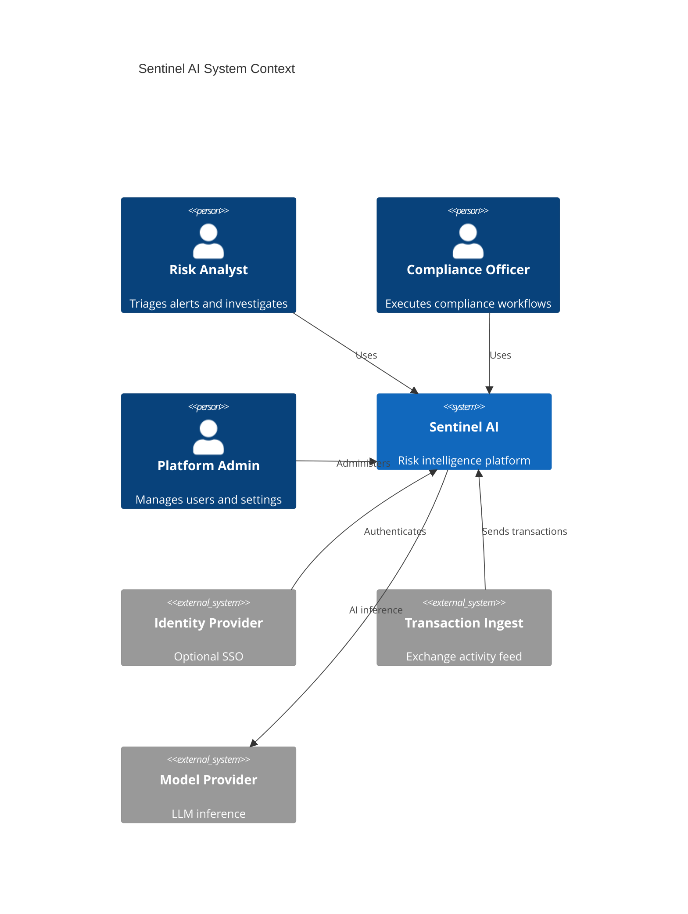
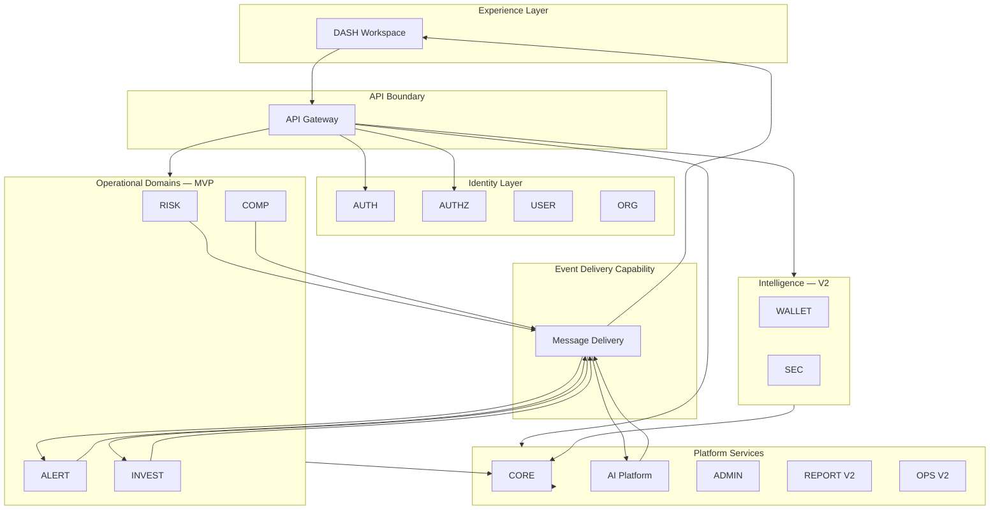
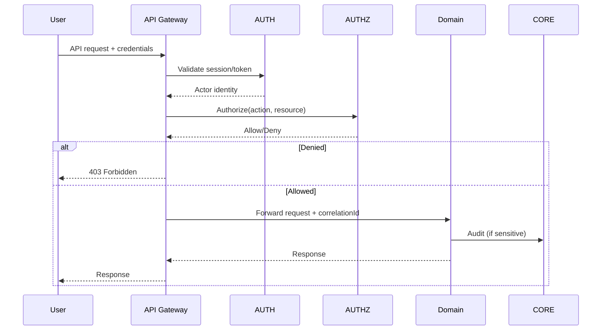
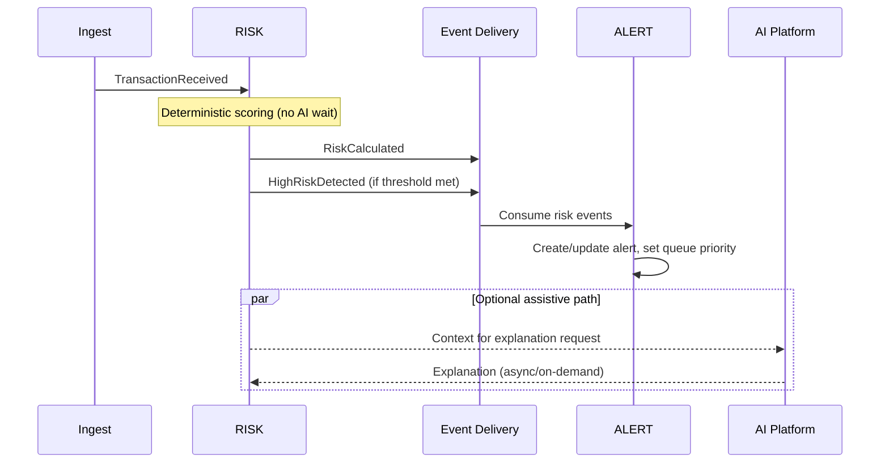
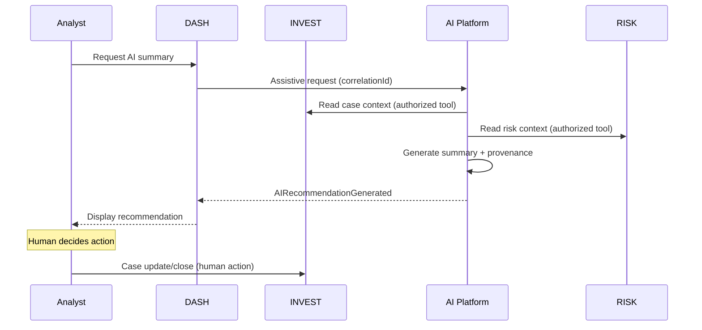

# System Architecture

## Document Information

| Field | Value |
|--------|-------|
| Project | Sentinel AI |
| Document | System Architecture |
| Version | 1.0 (Draft) |
| Status | Draft — Phase 2 |
| Owner | Architecture Team |
| Last Updated | 2026-09-03 |

---

## Revision History

| Version | Date | Author | Notes |
|---------|------|--------|-------|
| 0.1 | 2026-07-25 | — | Initial skeleton |
| 1.0 | 2026-09-03 | Architecture Team | Phase 2 logical architecture, flows, service boundaries |

---

## Architectural Goals

1. Modular domain architecture aligned to FDS
2. Event-driven integration between domains
3. Deterministic critical paths independent of AI
4. Security, audit, and observability by design
5. Graceful degradation of optional capabilities
6. Vendor-neutral capability descriptions

---

## System Context

Sentinel AI operates as an **internal risk intelligence platform** for cryptocurrency exchange operations. It integrates with external boundaries conceptually:

| External actor/system | Interaction |
|----------------------|-------------|
| Analysts, admins, compliance officers | Web workspace (DASH) |
| Identity provider | Authentication federation (AUTH) |
| Transaction/event ingest | External activity feed → RISK |
| Compliance providers | Embedded in COMP workflows (provider-neutral) |
| Model providers | AI inference (AI Platform) |
| Exchange enforcement systems | **Out of scope** — Sentinel recommends; exchange executes |



---

## Container / Service Diagram

Logical services map 1:1 to domains. Physical deployment may co-locate services initially (ADR-001).



---

## Service Boundary Rationale

| Service | Exists because | Initial deployment note |
|---------|----------------|-------------------------|
| **API Gateway** | Single security boundary, routing, rate limiting | Recommended from MVP |
| **AUTH** | Distinct security lifecycle; frozen domain | May share runtime with AUTHZ initially |
| **AUTHZ** | Policy evaluation separation | Often co-located with AUTH |
| **USER / ORG** | Lifecycle ownership separate from admin orchestration | Separate logical services |
| **RISK** | Highest throughput scoring; independent scaling | Scale independently |
| **ALERT** | Operational queue disinct from scoring | Separate from RISK |
| **INVEST** | Case lifecycle and evidence | Core MVP service |
| **COMP** | Regulatory workflow isolation | Separate for compliance audit scope |
| **DASH** | Presentation/BFF aggregation | Frontend-facing |
| **AI Platform** | Different failure mode, latency, cost profile | **Must** isolate from RISK critical path |
| **ADMIN** | Privileged operations segregation | Restrict network access |
| **WALLET / SEC** | V2 domains; optional MVP deployment | Deploy when V2 enabled |
| **REPORT / OPS** | V2 batch/ops workloads | Deferred deployables |
| **CORE** | Shared audit, config, health | Foundation service |
| **Notification** | Cross-cutting delivery | Deferred; not MVP lifecycle owner |

**Avoid microservice theater:** MVP may deploy as **modular services** (3–6 deployables) with clear module boundaries per domain, splitting further when metrics justify (ADR-001).

Suggested MVP physical grouping (implementation option, not mandate):

| Deployable | Modules |
|------------|---------|
| `platform-core` | CORE, AUTH, AUTHZ |
| `identity-tenant` | USER, ORG, ADMIN |
| `risk-operations` | RISK, ALERT |
| `investigation-compliance` | INVEST, COMP |
| `experience` | DASH |
| `ai-platform` | AI |

---

## Request Flow (Synchronous)



---

## Event Flow (Asynchronous)

See [EventArchitecture.md](EventArchitecture.md). MVP critical chain:

```text
TransactionReceived → RISK → RiskCalculated / HighRiskDetected → ALERT → AlertCreated → INVEST / DASH
```

---

## Risk Evaluation Flow



---

## Alert Flow

1. ALERT consumes `RiskCalculated` / `HighRiskDetected`
2. ALERT creates or updates alert with **owned** priority
3. ALERT publishes `AlertCreated` / updates
4. DASH refreshes queue; analyst dispositions
5. ALERT publishes `AlertClosed` or assigns via `AlertAssigned`
6. INVEST may consume `AlertCreated` for case creation

Human analyst owns disposition. AI may summarize for display only.

---

## Investigation Flow

1. Case created in INVEST (from alert or manual)
2. Evidence attached from RISK, ALERT, COMP contexts
3. Timeline maintained; assignment via `CaseAssigned`
4. Optional: AI assistive summary (does not close case)
5. Human closes case → `CaseClosed`
6. COMP may consume case events for compliance context

---

## Compliance Flow

1. COMP workflow initiated (KYC, AML, sanctions, Travel Rule)
2. Human reviewer executes workflow
3. COMP publishes `ComplianceReviewed`, etc.
4. Audit package prepared via COMP features
5. REPORT (V2) may consume for analytics

AI may retrieve documents; human approves outcomes.

---

## AI-Assisted Investigation Flow



AI never auto-closes cases.

---

## Security Monitoring Flow (V2)

1. AUTH publishes `UserLoggedIn` / `SessionExpired`
2. SEC consumes auth and alert/case context
3. SEC detects threats → `ThreatDetected`, etc.
4. ALERT may consume SEC signals (V2+ integration)
5. INVEST receives security context for compromise investigations

No autonomous containment in V2.

---

## Reporting Flow (V2)

1. REPORT consumes domain events (`CaseClosed`, `ComplianceReviewed`, etc.)
2. REPORT generates snapshots and reports
3. DASH navigates to REPORT outputs
4. Export with AUTHZ enforcement

---

## Administrative Flow

1. Admin authenticates with privileged role
2. ADMIN orchestrates settings, integrations
3. USER/ORG/AUTHZ domains execute lifecycle/policy changes
4. ADMIN publishes `AdminSettingUpdated`; CORE audits

ADMIN does not duplicate USER/ORG CRUD ownership.

---

## Operational Flow

| Release | Capability |
|---------|------------|
| MVP | CORE health endpoints, basic service metrics |
| V2 | OPS dashboards, backup status, ops alerting |

---

## Data Flow Principles

| Principle | Application |
|-----------|-------------|
| Source of truth per domain | No cross-domain mutable shared tables |
| Event-carried state transfer | Minimal payloads; reference IDs |
| Read models | DASH/REPORT may cache denormalized views |
| Audit | CORE pipeline; domains emit audit outcomes |

---

## Environment Boundaries

| Environment | Purpose |
|-------------|---------|
| Development | Feature development; synthetic data |
| Staging / Simulation | Exchange-modeled load; integration testing |
| Production | Real operations (future) |

Configuration and secrets are environment-separated (NFR-CFG-001). No production data in development.

---

## Quality Attributes

See [NonFunctionalRequirements.md](../02-requirements/NonFunctionalRequirements.md) and [ArchitecturePrinciples.md](ArchitecturePrinciples.md).

---

## Related Documents

| Document | Content |
|----------|---------|
| [DomainBoundaries.md](DomainBoundaries.md) | Per-domain ownership |
| [EventArchitecture.md](EventArchitecture.md) | Event contracts |
| [SecurityArchitecture.md](SecurityArchitecture.md) | Trust boundaries |
| [ObservabilityArchitecture.md](ObservabilityArchitecture.md) | Telemetry |
| [ArchitectureDecisionRecords.md](ArchitectureDecisionRecords.md) | ADRs |
| [Microservices.md](Microservices.md) | Legacy notes — see this document for Phase 2 baseline |

---

## Open Questions

| ID | Question |
|----|----------|
| SA-OQ-001 | Exact MVP deployable grouping — finalize at implementation kickoff |
| SA-OQ-002 | BFF vs client-direct domain API pattern for DASH |
